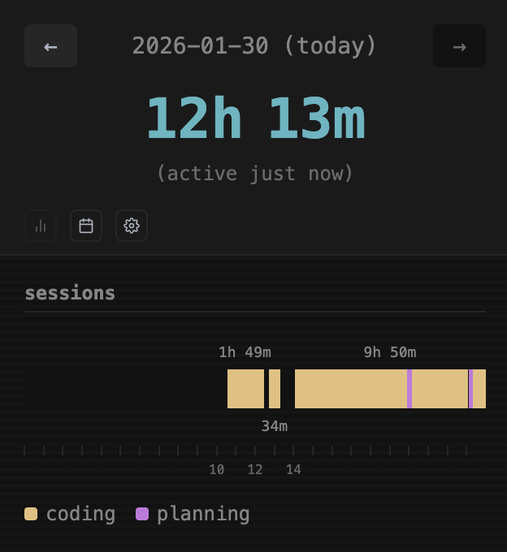
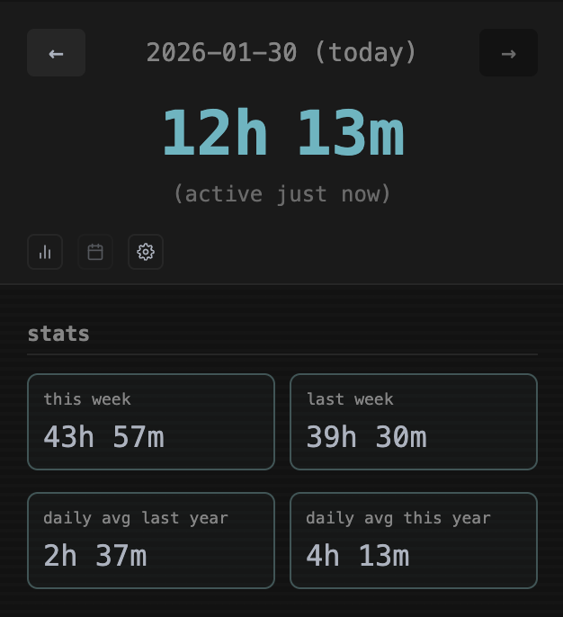
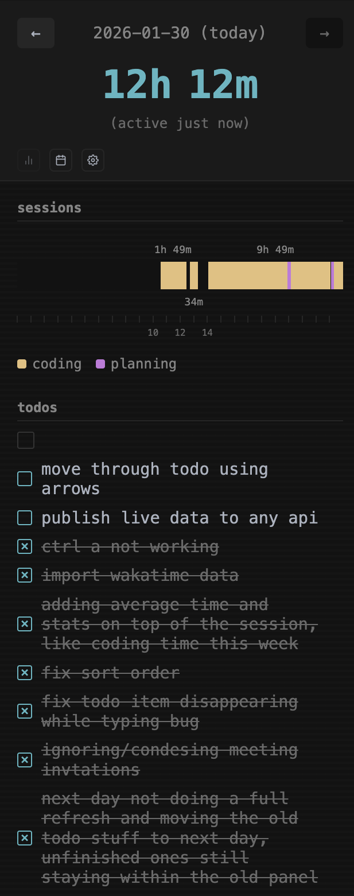
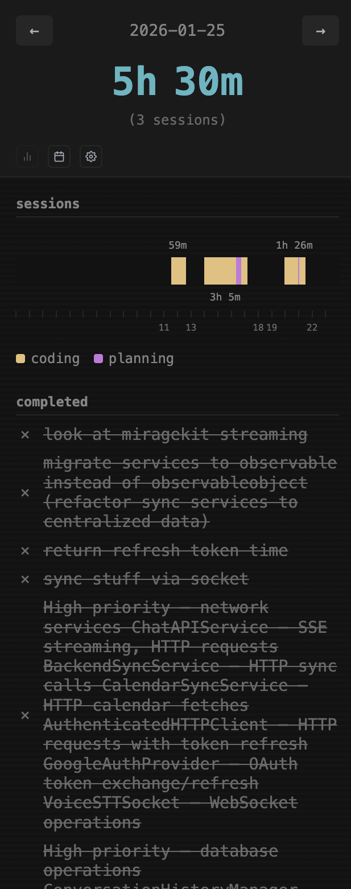

# cursor-time

A fully local and open source time tracking extension for Cursor IDE that automatically tracks your coding sessions, distinguishes between coding and AI-assisted planning time, and includes a built-in todo list. Incomplete todos automatically carry over to the next day, so you can seamlessly continue your work.

<table>
<tr>
<td width="50%"></td>
<td width="50%"></td>
</tr>
</table>

## Features

### Automatic Time Tracking

- Tracks activity through file changes (create, modify, delete)
- Detects Cursor AI agent activity by watching `~/.cursor/plans` and project-specific `agent-transcripts`/`agent-tools` folders
- Records heartbeats every 60 seconds during active work
- Groups activity into sessions with a 20-minute inactivity gap threshold (currently not configurable)

### Coding vs Planning Detection

The extension distinguishes between two activity types:

- **Coding**: File edits, code changes, and agent-assisted coding
- **Planning**: AI plan file modifications (requires 5+ consecutive planning heartbeats to be classified as planning time)

### Sessions Panel

- Visual timeline showing when you worked throughout the day
- Color-coded segments for coding (one color) and planning (another color)
- Navigate between days with arrow buttons
- Shows "active X mins ago" when viewing today

### Stats View

- This week's total time
- Last week's total time
- Daily average for this year
- Daily average for last year (if data exists)

### Todo List

<table>
<tr>
<td width="50%"></td>
<td width="50%"></td>
</tr>
</table>

*Left: Current day view with incomplete todos that carried over from previous days. Right: Past day view showing only completed todos.*

- Quick-add todos that persist per day
- Incomplete todos automatically carry over to the next day
- Drag and drop to reorder
- Inline editing (click to edit, Enter to save, Escape to cancel)
- Check off to mark complete
- When viewing past days, shows only completed todos for that day

### Status Bar

Shows at-a-glance time info in the status bar:
- Current coding time and planning time for today
- Last active indicator (e.g., "active 5 mins ago")

### Additional Features

- **WakaTime Import**: Import historical data from WakaTime JSON exports
- **Theme Switching**: Toggle between dark and blue themes
- **Customizable Keybindings**: Easily modify shortcuts through VS Code settings

## Keyboard Shortcuts

| Command | Mac | Windows/Linux |
|---------|-----|---------------|
| Open Panel | `Cmd+Shift+I` | `Ctrl+Shift+I` |
| New Todo | `Cmd+U` | `Ctrl+U` |

## Commands

Access via Command Palette (`Cmd+Shift+P` / `Ctrl+Shift+P`):

- `cursor-time: Open Panel` - Focus the sessions panel
- `cursor-time: New Todo` - Open panel and focus the todo input
- `cursor-time: Show Recent Heartbeats` - Display the last 50 heartbeats in the output channel for debugging

## Installation

### From Source

```bash
# Clone the repository
git clone https://github.com/ntna141/ntna-time.git
cd ntna-time

# Install dependencies
npm install

# Build and install the extension
npm run install-ext
```

This runs `install.sh` which will:
1. Compile the TypeScript source
2. Package the extension as a `.vsix` file using `vsce`
3. Install it to Cursor (or VS Code as fallback)

### Development

```bash
# Watch mode for development
npm run watch

# Compile for production
npm run compile

# Rebuild and reinstall the extension
npm run install-ext
```

## How It Works

### Heartbeat System

The extension uses a heartbeat-based tracking system:

1. **File Watcher**: Monitors all file changes in the workspace (ignoring `.git`, `node_modules`, `.cursor`, and common temporary files)
2. **Cursor Watcher**: Monitors Cursor's internal folders for AI agent activity and plan files
3. **Aggregator**: Collects activity events and flushes them as heartbeats every 60 seconds
4. **Session Builder**: Groups heartbeats into sessions when there's less than a 20-minute gap between them

### Data Storage

All data is stored in a local SQLite database at:
- `~/.cursor/extensions/cursor-time/cursor-time.db` (or equivalent VS Code global storage path)

Tables:
- `heartbeats` - Raw activity records
- `daily_sessions_cache` - Precomputed daily session summaries
- `aggregate_sessions_cache` - Weekly/yearly aggregates for fast stats
- `todos` - Todo items with date association

### File Filtering

The extension automatically ignores:
- Files in `.cursor`, `.git`, and `node_modules` directories
- Lock files (`.lock`, `.tmp`, `.swp`, etc.)
- Git internal files (`FETCH_HEAD`, `HEAD.lock`, etc.)
- `.DS_Store` and similar system files

## Settings Panel

Access the settings panel by clicking the gear icon in the sessions view:

- **Change Keybinds**: Opens VS Code's keyboard shortcuts settings
- **Theme**: Toggle between dark and blue color schemes
- **Import WakaTime**: Import data from a WakaTime JSON export file

## License

MIT
